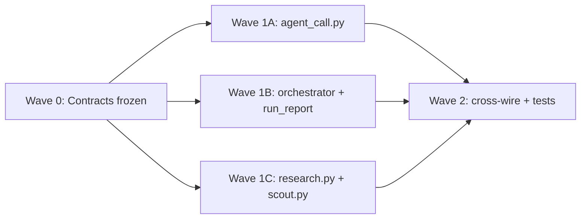

# Implementation Plan: Dispatch Telemetry (Spec 028)

**Branch**: `028-dispatch-telemetry-plan` | **Date**: 2026-05-26 | **Spec**: [spec.md](./spec.md)
**Input**: Feature specification from `/specs/028-dispatch-telemetry/spec.md`

## Summary

Fix three production cost-blindness bugs around `scripts/agent_call.py::dispatch()` and the CLI `--cost-sidecar` path: (1) programmatic `dispatch()` hard-codes `cost_usd` / token counts to zero and uses `cost_usd == 0.0` as a fake-agent timestamp heuristic; (2) repeated dispatches for the same `stage` overwrite `agent-calls/{stage}.json`; (3) multi-batch note-writer loops overwrite a single `cycle-{N}-research.cost.json`. The fix unifies all cost telemetry under **sidecar v1.0** in `<vault>/_pipeline/cycles/cycle-NNN/agent-calls/`, reuses the existing CLI stream-json parser for `dispatch()`, adds explicit `agent_kind` + `status` fields, and retargets `_sum_sidecar_costs` to glob-based discovery. Spec 033 (cost enforcement) depends on the load-bearing contract in `contracts/sidecar-v1.contract.md`.

## Technical Context

**Language/Version**: Python 3.11+ (per `pyproject.toml`, constitution Technology Constraints)
**Primary Dependencies**: Existing only — `jinja2 ≥ 3.1`, `pyyaml ≥ 6.0`, `sqlite3` (stdlib). Dispatch lives in `scripts/agent_call.py` (vault-copied shim); consumers in `src/research_framework/pipeline/`.
**Storage**: Filesystem — per-call/per-batch JSON sidecars under `<vault>/_pipeline/cycles/cycle-NNN/agent-calls/`. Legacy `cycle-{N}-*.cost.json` flat paths **retired** (FR-006).
**Testing**: pytest per ADR-0008 — tier-2 contract/unit for sidecar schema + path allocator; tier-3 integration for collision + `_sum_sidecar_costs` batch summation; tier-4 component for `dispatch()` through fake agent; `@pytest.mark.live_llm` opt-in for SC-001 parity (US1). No new test machinery — populate spec **Acceptance coverage** slots in `/speckit.tasks`. Smoke gate (ADR-0007) unchanged unless a new tier-2 guard is warranted for sidecar schema (defer to tasks).
**Target Platform**: macOS + Linux (vault operator workstations; CI Linux pending spec 009)
**Project Type**: Python library + vault-local `scripts/agent_call.py` shim
**Performance Goals**: Sidecar write overhead negligible vs LLM latency; allocator is O(files in `agent-calls/`) per dispatch
**Constraints**: Principle V — **no new runtime dependencies**. Principle IV — all LLM subprocesses stay in `agent_call.py`. Fake-agent timestamp strings must remain byte-identical for tier-5/6 replay.
**Scale/Scope**: ~4 production modules (`scripts/agent_call.py`, `pipeline/orchestrator.py`, `pipeline/steps/research.py`, `pipeline/steps/scout.py`, `pipeline/run_report.py`); extends spec-025 sidecar v1.0 schema with `agent_kind`, `status`, optional batch discriminators

## Constitution Check

*GATE: Must pass before Phase 0 research. Re-check after Phase 1 design.*

| Principle / ADR | Requirement | Plan compliance |
|-----------------|-------------|-----------------|
| **III — Test-First** | Tests alongside behaviour change | Each FR maps to tier-2/3/4 tests in Acceptance coverage; SC-005 needs tier-3 budget-cap integration |
| **IV — Agent-Script Separation** | Scripts validate; agents don't self-assess | Sidecars are script-written artifacts; orchestrator reads them for cap math — no agent judgment |
| **V — Offline-First / No new deps** | Stdlib + existing deps only | `json`, `pathlib`, `os.replace`, `datetime`, `subprocess` — no new packages |
| **ADR-0007 — Smoke gate** | Mandatory, no skip | New tests default to fast loop (`pytest -m "not e2e"`); only extend `build.sh::SMOKE_TESTS` if a tier-5 regression is added (tasks decision) |
| **ADR-0008 — Pyramid** | Lowest tier that catches the bug | Unit (allocator, schema) → integration (`_sum_sidecar_costs`) → component (`dispatch` mock) → optional `live_llm` |
| **ARCHITECTURE §6 — Single dispatch** | All LLM via `agent_call.py` | Changes stay inside `scripts/agent_call.py` + callers pass `cycle_dir`; no new dispatch surface |
| **Spec 025 contract** | `llm-dispatch.contract.md` §3 base schema | Extended by `sidecar-v1.contract.md` (additive fields + path rules); 025 contract remains historical reference |

**Gate status (pre-design)**: PASS — no violations.

**Gate status (post-design)**: PASS — design uses filesystem sidecars only, reuses stream-json parser, preserves fake-agent determinism. No Complexity Tracking table required.

## Project Structure

### Documentation (this feature)

```text
specs/028-dispatch-telemetry/
├── spec.md
├── plan.md                    # This file
├── research.md                # Phase 0
├── data-model.md              # Phase 1 — entity + JSON Schema
├── quickstart.md              # Phase 1 — operator walkthrough
├── contracts/
│   ├── sidecar-v1.contract.md       # LOAD-BEARING for spec 033
│   └── dispatch-protocol.contract.md
└── tasks.md                   # Phase 2 — /speckit.tasks (not created here)
```

### Source Code (implementation targets — no edits in planning phase)

```text
scripts/
└── agent_call.py              # dispatch(), _run_claude_with_cost(), --cost-sidecar CLI
                               # NEW: _allocate_sidecar_path(), shared stream-json extractor,
                               # agent_kind, status, atomic write

src/research_framework/pipeline/
├── orchestrator.py            # _sum_sidecar_costs, _cumulative_sidecar_cost, budget cap
├── run_report.py              # cost rollup glob (currently cycle-*-*.cost.json)
├── steps/
│   ├── research.py            # per-batch --cost-sidecar paths (FR-006)
│   └── scout.py               # scout --cost-sidecar path retarget
└── _cycle_helpers.py          # probe/scout cost-sidecar call sites (audit in tasks)

tests/                         # populated by /speckit.tasks — see Acceptance coverage
├── scripts/                   # tier-2: sidecar schema, path allocator
├── pipeline/                  # tier-3: _sum_sidecar_costs, batch collision
└── (optional live_llm)        # tier-2/3 with @pytest.mark.live_llm for SC-001
```

**Structure Decision**: Single Python package; telemetry is a cross-cutting patch to the existing dispatch boundary (`scripts/agent_call.py`) plus orchestrator consumers. No new packages.

## Implementation Waves (parallel-agent ready)

Designed for `/dispatching-parallel-agents` after `/speckit.tasks` locks file-level tasks.



| Wave | Owner track | Scope | Depends on |
|------|-------------|-------|------------|
| **0** | (planning — done) | `contracts/sidecar-v1.contract.md`, `data-model.md` | — |
| **1A** | Agent — dispatch core | `dispatch()` stream-json reuse, `agent_kind`, `status`, path allocator, `AgentCallResult` population, failure sidecars (FR-001–005, 010–012) | Wave 0 |
| **1B** | Agent — consumers | `_sum_sidecar_costs`, `_cumulative_sidecar_cost`, `run_report.py` glob (FR-007) | Wave 0 |
| **1C** | Agent — CLI call sites | `research.py` / `scout.py` `--cost-sidecar` → `agent-calls/{stage}-batch-{B}.json`; CLI `--cost-sidecar` emits v1.0 (FR-006) | Wave 0 |
| **2** | Single agent or coordinator | Wire tests per Acceptance coverage; fixture timestamp audit; optional quality-baseline touch | 1A+1B+1C |

**Conflict boundaries**: 1A owns `scripts/agent_call.py` only. 1B owns `orchestrator.py` + `run_report.py`. 1C owns `pipeline/steps/{research,scout}.py`. Shared helper extraction (stream-json parser) MUST land in 1A first; 1C calls CLI flags only — no duplicate parsing logic.

## Acceptance coverage (plan reference)

The spec defers evidence cells to `/speckit.tasks`. Planned test placement:

| User Story | Planned evidence (tier) |
|------------|-------------------------|
| US1 — Per-call cost telemetry | tier-2 unit: sidecar schema + real vs fake `agent_kind`; tier-4 component: `test_plan_narrator` / probe dispatch mocks; tier-2/3 `@pytest.mark.live_llm`: SC-001 parity |
| US2 — Sidecar non-collision | tier-2 unit: `_allocate_sidecar_path` sequence; tier-3 integration: two `dispatch()` same stage → distinct files |
| US3 — Per-batch note-writer costs | tier-3 integration: multi-batch fixture → N `note_writer-batch-*.json`; `_sum_sidecar_costs` sum; SC-005 budget-cap halt |

## Complexity Tracking

> No constitution violations — table intentionally empty.
