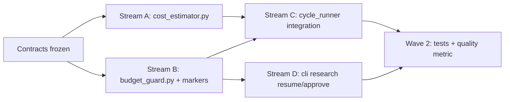

# Implementation Plan: Cost Enforcement (Spec 033)

**Branch**: `033-cost-enforcement-plan` | **Date**: 2026-05-26 | **Spec**: [spec.md](./spec.md)
**Input**: Feature specification from `/specs/033-cost-enforcement/spec.md`
**Upstream contracts (read-only)**: [`specs/028-dispatch-telemetry/contracts/sidecar-v1.contract.md`](../028-dispatch-telemetry/contracts/sidecar-v1.contract.md), [`dispatch-protocol.contract.md`](../028-dispatch-telemetry/contracts/dispatch-protocol.contract.md)

## Summary

Turn honest dispatch telemetry (spec 028 sidecar v1.1) into **hard per-cycle enforcement**: dollar cap (`limits.cycle_budget_usd`), parallel codex token cap (`limits.codex_token_budget`), wall-clock backstop (`limits.cycle_wallclock_budget_minutes`), and opt-in per-stage approval gates (`approval_gates`). Before every dispatch, `budget_guard` checks conservative pre-dispatch estimates (two-tier: zero-dep p95-history / default ceiling, optional `tiktoken` via `[budget]` extra) against inclusive `<=` cap semantics — pause only on strict exceed (`>`). On pause, write `_pipeline/BUDGET_PAUSED` (JSON, atomic) or `_pipeline/APPROVAL_REQUIRED` (separate file, same resume path); exit non-zero; `./vault research --resume` validates caps or explicit bypass flags (`--force-budget`, `--approve <stage>`) with TTY vs headless UX divergence (FR-016). Post-dispatch, refresh running tallies from `agent-calls/*.json` sidecars per 028 contract.

## Technical Context

**Language/Version**: Python 3.11+ (per `pyproject.toml`, constitution Technology Constraints)
**Primary Dependencies**: Existing mandatory — `pyyaml ≥ 6.0`, stdlib (`json`, `pathlib`, `hashlib`, `subprocess`, `argparse`, `dataclasses`, `contextlib`, `time`). **Optional** — `tiktoken ≥ 0.6` via `pyproject.toml::[project.optional-dependencies].budget` (`pip install research-framework[budget]`); import-gated at runtime, never required for core install (Principle V).
**Storage**: Filesystem — `<vault>/_pipeline/BUDGET_PAUSED`, `<vault>/_pipeline/APPROVAL_REQUIRED`; sidecar reads from `<vault>/_pipeline/cycles/cycle-NNN/agent-calls/*.json` (028 path only); `dist-templates/cost-estimates.yaml` + per-vault override for zero-history fallback.
**Testing**: pytest per ADR-0008 — tier-2 unit (`cost_estimator`, `budget_guard` pure logic, cap inequality, calibration); tier-3 integration (marker atomic write, `--resume` + marker detection, headless env gates); tier-5 e2e (BUDGET_PAUSED mid-cycle → resume → complete). Spec 022 v3 metric `cost_per_substantive_note` hooks quality harness (soft coupling to 030).
**Target Platform**: macOS + Linux vault workstations; CI headless paths use env-var acks
**Project Type**: Python library + vault-local `./vault research` CLI
**Performance Goals**: Pre-dispatch estimate + cap check &lt; 50 ms p95 (no LLM roundtrip); sidecar re-read O(files in `agent-calls/`) per dispatch boundary
**Constraints**: Principle IV — enforcement reads script-written sidecars only; no agent self-assessment. Principle V — `tiktoken` OPTIONAL extra only. Inclusive `<=` cap (Q5). TTY/headless share caps, diverge resume UX (Q3). Codex token cap parallel to USD cap (Q4), no fake $/token conversion.
**Scale/Scope**: 2 new pipeline modules, extend `settings.py`, integrate `cycle_runner.py` + `cli/research*.py`, optional `quality/metrics/` touch for US3, `pyproject.toml` `[budget]` extra

## Constitution Check

*GATE: Must pass before Phase 0 research. Re-check after Phase 1 design.*

| Principle / ADR | Requirement | Plan compliance |
|-----------------|-------------|-----------------|
| **III — Test-First** | Tests with behaviour | Tier-2/3/5 matrix in research.md; US1–US4 map to Acceptance coverage |
| **IV — Agent-Script Separation** | Scripts enforce; agents don't | `budget_guard` + sidecar reads only; estimates logged as `estimation_method` on dispatch metadata (not agent judgment) |
| **V — No new mandatory runtime deps** | Stdlib + existing only for default install | Default path: p95 history + `cost-estimates.yaml`. **`tiktoken` is `[project.optional-dependencies].budget` only** — gated `try/import`; failure → per-stage ceiling (never underestimate). **Does NOT violate Principle V** (optional extra ≠ mandatory runtime dep) |
| **ADR-0007 — Smoke gate** | Mandatory | New tier-2 tests in fast loop; tier-5 e2e only if added to `build.sh::SMOKE_TESTS` (tasks decision) |
| **ADR-0008 — Pyramid** | Lowest tier | Unit → integration → e2e per research.md |
| **ARCHITECTURE §6 — Single dispatch** | All LLM via `agent_call.py` | Cap check wraps dispatch call sites in `cycle_runner` / steps; no second dispatch surface |
| **028 sidecar contract** | Authoritative billing inputs | `budget_guard` sums `cost_usd` / `tokens_in` / `tokens_out` from `agent-calls/*.json` only — see [`sidecar-v1.contract.md`](../028-dispatch-telemetry/contracts/sidecar-v1.contract.md) §5 |

**Gate status (pre-design)**: PASS — optional `tiktoken` explicitly scoped; no mandatory new deps.

**Gate status (post-design)**: PASS — contracts keep markers script-owned; 028 schema referenced not redefined; Complexity Tracking empty.

## Project Structure

### Documentation (this feature)

```text
specs/033-cost-enforcement/
├── spec.md
├── plan.md                         # This file
├── research.md                     # Phase 0
├── data-model.md                   # Phase 1 — markers + tally + calibration
├── quickstart.md                   # Phase 1 — operator walkthrough
├── contracts/
│   ├── budget-marker.contract.md   # BUDGET_PAUSED
│   ├── approval-marker.contract.md # APPROVAL_REQUIRED
│   └── cost-estimator.contract.md  # Two-tier estimate API
└── tasks.md                        # Phase 2 — /speckit.tasks (not created here)
```

### Source Code (implementation targets — planning only; no edits in this phase)

```text
pyproject.toml
└── [project.optional-dependencies]
    budget = ["tiktoken>=0.6"]

dist-templates/
└── cost-estimates.yaml             # Per-stage default ceilings (FR-003 zero-history fallback)

src/research_framework/pipeline/
├── cost_estimator.py               # NEW — p95 / default_ceiling / optional tiktoken
├── budget_guard.py                 # NEW — cap checks, marker write, tally refresh
├── settings.py                     # EXTEND — limits.*, approval_gates, estimator_calibration
├── cycle_runner.py                 # INTEGRATE — pre-dispatch check(); post-dispatch tally
└── orchestrator.py                 # MAY delegate _sum_sidecar_costs retarget to agent-calls/ (028)

src/research_framework/cli/
├── research.py                     # Surface --approve, wire resume marker reads
├── research_generate.py            # --force-budget, --approve-all passthrough
└── research_resume.py              # BUDGET_PAUSED + APPROVAL_REQUIRED handling

src/research_framework/quality/metrics/   # US3 — cost_per_substantive_note (022 v3 hook)

tests/
├── pipeline/test_cost_estimator.py         # tier-2
├── pipeline/test_budget_guard.py           # tier-2
├── pipeline/test_budget_markers.py         # tier-3
└── e2e/test_budget_pause_resume.py         # tier-5 (tasks)
```

**Structure Decision**: Single Python package; enforcement is a cross-cutting layer on the existing dispatch boundary, consuming 028 sidecars as the sole post-dispatch cost source.

## Implementation parallelization

Designed for `/dispatching-parallel-agents` after `/speckit.tasks` locks file-level ownership.



| Stream | Modules | Parallelizable with | Blocked until |
|--------|---------|---------------------|---------------|
| **A** | `cost_estimator.py`, `dist-templates/cost-estimates.yaml` | B (no shared files) | Contracts: `cost-estimator.contract.md` |
| **B** | `budget_guard.py`, marker contracts | A | `budget-marker.contract.md`, `approval-marker.contract.md` |
| **C** | `cycle_runner.py`, `settings.py` limits | — | A + B APIs stable |
| **D** | `cli/research*.py` flags + resume | B marker read protocol | B marker contract |
| **E** | tests, `quality/metrics`, harness baseline | C + D wired | Streams A–D |

**Conflict boundaries**: A owns pure estimation (no filesystem). B owns `_pipeline/*` marker I/O. C owns dispatch loop call sites only. D owns CLI UX (TTY/headless). Do not duplicate sidecar parsing — single helper in `budget_guard` (or reuse orchestrator `_sum_sidecar_costs` after 028 retarget).

## Acceptance coverage (plan reference)

| User Story | Planned evidence (tier) |
|------------|-------------------------|
| US1 — Cycle budget cap pause/resume | tier-2: inclusive `<=` + strict `>` pause; tier-3: marker write + `--resume`; tier-5: mid-cycle pause → resume completes |
| US2 — Per-tier guardrails | tier-2: threshold compare; tier-3: cycle report warning row |
| US3 — cost_per_substantive_note | tier-2/3: quality metric calculator; `./build.sh --quality` baseline update |
| US4 — source_cache_hit_ratio | tier-3: deferred until 020 cache exists; stub returns N/A |

## Complexity Tracking

> No constitution violations — table intentionally empty.
